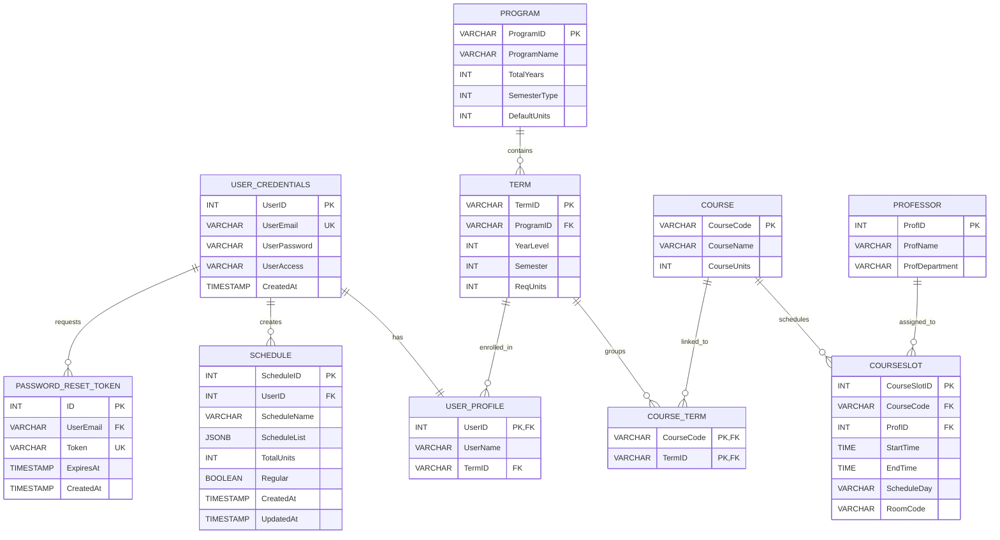

# Database Schema & SQL Query Documentation

This document provides a comprehensive overview of the PostgreSQL database schema, relational structure, active SQL queries, and join methodologies utilized in the **Academic Schedule Builder** backend endpoints.

---

## 1. Entity Relationship Diagram (ERD)

Below is the visual relational structure of the database tables, illustrating the foreign key constraints, optionality, and cardinalities.



---

## 2. Table Definitions

### `USER_CREDENTIALS`
Manages user authentication accounts.
* `UserID` (SERIAL PRIMARY KEY)
* `UserEmail` (VARCHAR(255) UNIQUE NOT NULL)
* `UserPassword` (VARCHAR(255) NOT NULL - AES Encrypted)
* `UserAccess` (VARCHAR(50) DEFAULT 'Default' - Restricts access to Super Admins (`Admin` / `Default`))
* `CreatedAt` (TIMESTAMP DEFAULT CURRENT_TIMESTAMP)

### `USER_PROFILE`
Stores supplemental profile details for active student users.
* `UserID` (INT PRIMARY KEY REFERENCES `USER_CREDENTIALS(UserID)` ON DELETE CASCADE)
* `UserName` (VARCHAR(255) NOT NULL)
* `TermID` (VARCHAR(10) REFERENCES `TERM(TermID)` ON DELETE SET NULL)

### `PROGRAM`
Holds educational departments/tracks (e.g., BSCS, BSIT).
* `ProgramID` (VARCHAR(10) PRIMARY KEY)
* `ProgramName` (VARCHAR(255) NOT NULL)
* `TotalYears` (INT NOT NULL CHECK between 1 and 6)
* `SemesterType` (INT NOT NULL CHECK 1, 2, or 3)
* `DefaultUnits` (INT NOT NULL DEFAULT 18)

### `TERM`
Represents individual academic blocks per program (e.g., BSCS Year 1 Sem 1).
* `TermID` (VARCHAR(10) PRIMARY KEY)
* `ProgramID` (VARCHAR(10) NOT NULL REFERENCES `PROGRAM(ProgramID)` ON DELETE CASCADE)
* `YearLevel` (INT NOT NULL CHECK 1 to 6)
* `Semester` (INT NOT NULL CHECK 1 to 3)
* `ReqUnits` (INT)
* *Constraint*: `UNIQUE(ProgramID, YearLevel, Semester)`

### `COURSE`
Global catalog of educational topics.
* `CourseCode` (VARCHAR(15) PRIMARY KEY)
* `CourseName` (VARCHAR(255) NOT NULL)
* `CourseUnits` (INT)

### `COURSE_TERM`
Many-to-many junction mapping courses to specific academic terms.
* `CourseCode` (VARCHAR(15) REFERENCES `COURSE(CourseCode)` ON DELETE CASCADE)
* `TermID` (VARCHAR(10) REFERENCES `TERM(TermID)` ON DELETE CASCADE)
* *Constraint*: `PRIMARY KEY (CourseCode, TermID)`

### `PROFESSOR`
Staff database.
* `ProfID` (SERIAL PRIMARY KEY)
* `ProfName` (VARCHAR(255) NOT NULL)
* `ProfDepartment` (VARCHAR(255))

### `COURSESLOT`
Concrete instances of physical lectures, scheduling a course with a day, time, room, and professor.
* `CourseSlotID` (SERIAL PRIMARY KEY)
* `CourseCode` (VARCHAR(15) NOT NULL REFERENCES `COURSE(CourseCode)` ON DELETE CASCADE)
* `ProfID` (INT REFERENCES `PROFESSOR(ProfID)` ON DELETE SET NULL)
* `StartTime` (TIME NOT NULL)
* `EndTime` (TIME NOT NULL)
* `ScheduleDay` (VARCHAR(50))
* `RoomCode` (VARCHAR(20))

### `SCHEDULE`
Saves custom scheduler assemblies designed by student profiles.
* `ScheduleID` (SERIAL PRIMARY KEY)
* `UserID` (INT NOT NULL REFERENCES `USER_CREDENTIALS(UserID)` ON DELETE CASCADE)
* `ScheduleName` (VARCHAR(255) NOT NULL)
* `ScheduleList` (JSONB DEFAULT '[]'::jsonb - Array of slot objects)
* `TotalUnits` (INT DEFAULT 0)
* `Regular` (BOOLEAN DEFAULT TRUE)
* `CreatedAt` / `UpdatedAt` (TIMESTAMP)

### `PASSWORD_RESET_TOKEN`
Holds numeric secure PINs requested during account recovery.
* `ID` (SERIAL PRIMARY KEY)
* `UserEmail` (VARCHAR(255) REFERENCES `USER_CREDENTIALS(UserEmail)` ON DELETE CASCADE)
* `Token` (VARCHAR(255) UNIQUE NOT NULL)
* `ExpiresAt` (TIMESTAMP NOT NULL)
* `CreatedAt` (TIMESTAMP)

---

## 3. Detailed Endpoint Query Analysis

### A. Public & Student Endpoints

#### 1. `POST /api/signup`
Creates user login records and their corresponding empty profiles.
```sql
-- Query 1: Insert into Credentials
INSERT INTO user_credentials (useremail, userpassword, useraccess) 
VALUES (LOWER($1), $2, $3) 
RETURNING userid;

-- Query 2: Insert into Profile
INSERT INTO user_profile (userid, username) 
VALUES ($1, $2);
```

#### 2. `POST /api/login`
Validates user authentication and retrieves profile info.
```sql
SELECT uc.userid, uc.userpassword, uc.useraccess, up.username 
FROM user_credentials uc 
LEFT JOIN user_profile up ON uc.userid = up.userid 
WHERE LOWER(uc.useremail) = LOWER($1);
```
* **Join Explained (`LEFT JOIN user_profile`)**: Ensures the query successfully returns credentials even if a user profile record is missing or failed to initialize during signup, avoiding a hard crash while logging in.

#### 3. `GET /api/courses`
Loads the available courses and their scheduled slot options for the student's current Term.
```sql
SELECT
  c.coursecode as course_id,
  c.coursecode as code,
  c.coursename as name,
  c.courseunits as units,
  cs.courseslotid as courseslot_id,
  t.programid as program_id,
  t.yearlevel as year_level,
  t.semester as semester,
  p.profname as teacher_name,
  p.profdepartment as teacher_dept,
  cs.scheduleday as schedule_day,
  cs.starttime as start_time,
  cs.endtime as end_time,
  cs.roomcode as room
FROM course c
JOIN course_term ct ON c.coursecode = ct.coursecode
JOIN term t ON ct.termid = t.termid
LEFT JOIN courseslot cs ON c.coursecode = cs.coursecode
LEFT JOIN professor p ON cs.profid = p.profid
WHERE ct.termid = $1 AND cs.courseslotid IS NOT NULL
ORDER BY c.coursecode;
```
* **Joins Explained**:
  * `JOIN course_term ct`: **Inner Join** restricts results to courses specifically mapped to the active term.
  * `JOIN term t`: **Inner Join** pulls term metadata (program, level, sem) linked to the course-term junction.
  * `LEFT JOIN courseslot cs`: **Left Join** retrieves scheduling occurrences for the course (day, time, room).
  * `LEFT JOIN professor p`: **Left Join** links professor details to the course slot. A left join is necessary because the system permits course slots with unassigned teachers (`cs.profid IS NULL`).

#### 4. `GET /api/schedule`
Retrieves a list of custom schedules created by the logged-in student.
```sql
-- Query 1: Fetch all user schedules
SELECT scheduleid, schedulename, schedulelist, totalunits 
FROM schedule 
WHERE userid = $1;

-- Query 2: Fetch concrete slot details inside schedule JSONB assemblies
SELECT 
  c.coursecode as course_id,
  cs.courseslotid as courseslot_id,
  c.coursecode as code,
  c.coursename as name,
  c.courseunits as units,
  (SELECT t2.programid FROM course_term ct2 JOIN term t2 ON ct2.termid = t2.termid WHERE ct2.coursecode = c.coursecode LIMIT 1) as program_id,
  p.profname as teacher_name,
  cs.scheduleday as schedule_day,
  cs.starttime as start_time,
  cs.endtime as end_time,
  cs.roomcode as room
FROM courseslot cs
JOIN course c ON cs.coursecode = c.coursecode
LEFT JOIN professor p ON cs.profid = p.profid
WHERE cs.courseslotid = ANY($1::integer[]);
```
* **Join Explained (`JOIN course`)**: **Inner Join** links the concrete time-slot instance to the parent catalog entry to fetch critical details like code, description, and academic units.
* **Join Explained (`LEFT JOIN professor`)**: Allows fetching slot information even if a professor is not assigned.
* **PostgreSQL Functionality (`ANY($1::integer[])`)**: Filters the query against an array of integers parsed dynamically from the `schedulelist` JSONB collection, executing one highly optimized index look-up instead of multiple separate SQL requests or dynamically building `IN (...)` queries.
* **Scalar Subquery Join**: A correlated inner join subquery fetches the program track associated with the course via `course_term` and `term`.

#### 5. `DELETE /api/schedule`
Deletes a single course slot selection out of a student's schedule list directly in SQL.
```sql
UPDATE schedule 
SET schedulelist = (
  SELECT jsonb_agg(item) 
  FROM jsonb_array_elements(schedulelist) item 
  WHERE item->>'courseslot_id' != $1
)
WHERE scheduleid = $2 AND userid = $3
RETURNING scheduleid;
```
* **PostgreSQL JSONB Features**:
  * `jsonb_array_elements(schedulelist)`: Flattens the array records out of the JSONB field into standard virtual table rows.
  * `item->>'courseslot_id'`: Extracts JSON key properties directly in SQL as strings to filter out the target deletion target.
  * `jsonb_agg(...)`: Re-compiles the remaining virtual rows back into a single JSONB array structure, enabling zero-overhead direct array modification at the DB layer without doing roundtrips to the node server.

#### 6. `POST /api/term`
Saves the student's default curriculum configuration block.
```sql
-- Query 1: Find the relevant Term ID
SELECT termid FROM term WHERE programid = $1 AND yearlevel = $2 AND semester = $3;

-- Query 2: Apply Term ID into Profile
UPDATE user_profile SET username = $1, termid = $2 WHERE userid = $3;
```

#### 7. `GET /api/term`
Resolves active curriculum constraints.
```sql
SELECT t.termid as term_id, t.programid as program_id, t.yearlevel as year_level, t.semester as semester, t.requnits as req_units
FROM user_profile up
JOIN term t ON up.termid = t.termid
WHERE up.userid = $1;
```
* **Join Explained (`JOIN term`)**: **Inner Join** connects the foreign key pointer stored in `user_profile` to the `term` catalog to obtain structural information (program code, target requirements, sem).

---

### B. Admin Console Endpoints

#### 1. `GET /api/admin/users`
Returns all users in the system (except the primary system administrator) alongside their profile configurations.
```sql
SELECT uc.userid, uc.useremail, uc.userpassword, uc.useraccess, uc.createdat, up.username, up.termid
FROM user_credentials uc
LEFT JOIN user_profile up ON uc.userid = up.userid
WHERE LOWER(uc.useremail) != 'admin@gmail.com'
ORDER BY uc.userid ASC;
```
* **Join Explained (`LEFT JOIN user_profile`)**: Fetches profile elements matching login IDs. The left join guarantees that login accounts that failed to create profiles still render in the admin center for system transparency and troubleshooting.

#### 2. `GET /api/admin/courses`
Provides a listing of all course items with the exact terms they belong to compiled inside an array.
```sql
SELECT c.coursecode, array_agg(ct.termid) as termids, c.coursename, c.courseunits
FROM course c
LEFT JOIN course_term ct ON c.coursecode = ct.coursecode
GROUP BY c.coursecode, c.coursename, c.courseunits
ORDER BY c.coursecode ASC;
```
* **PostgreSQL Functionality (`array_agg`)**: Merges multiple term relationships matching the left join query from the junction table `course_term` directly into an native SQL array string (e.g. `['BSCS1', 'BSCS2']`), avoiding redundant duplicate course entries and nested querying loops.

#### 3. `GET /api/admin/courseslots`
Provides a detailed index of schedule listings in the database.
```sql
SELECT cs.courseslotid, cs.coursecode, cs.profid, cs.starttime, cs.endtime, cs.scheduleday, cs.roomcode,
       c.coursename, p.profname
FROM courseslot cs
LEFT JOIN course c ON cs.coursecode = c.coursecode
LEFT JOIN professor p ON cs.profid = p.profid
ORDER BY cs.courseslotid ASC;
```
* **Joins Explained**:
  * `LEFT JOIN course c`: Links structural catalog labels (e.g. course title) onto the timeline instance.
  * `LEFT JOIN professor p`: Retrieves the teacher name. Using a left join allows slots without a designated professor to still display in the admin dashboard interface.

#### 4. `GET /api/admin/schedules`
Lists all schedules saved by the users.
```sql
SELECT s.scheduleid, s.userid, s.schedulename, s.schedulelist, s.totalunits, s.regular, s.createdat, s.updatedat,
       uc.useremail, up.username
FROM schedule s
LEFT JOIN user_credentials uc ON s.userid = uc.userid
LEFT JOIN user_profile up ON s.userid = up.userid
ORDER BY s.scheduleid ASC;
```
* **Joins Explained**:
  * `LEFT JOIN user_credentials uc` and `LEFT JOIN user_profile up` are used to associate the schedule records with the user's primary login email and profile display username, providing administrators with complete contextual details about schedule ownership.

---

## 4. Key Relational DB Features Utilized

### A. Database Transactions (`BEGIN`, `COMMIT`, `ROLLBACK`)
Critical endpoints modifying multiple dependent tables (such as `POST /api/admin/users`, `PUT /api/admin/users/:id`, `POST /api/admin/courses`, `POST /api/term`) employ transactional queries:
1. `BEGIN` is declared to allocate transaction scope.
2. If any subquery triggers errors (e.g., validation failure or email duplication), a `ROLLBACK` is immediately invoked to discard partial writes.
3. Once all sub-queries are completed successfully, `COMMIT` is executed to finalize changes.

### B. Foreign Key Cascading Referential Actions
Database-level constraints manage clean data maintenance automatically:
* `ON DELETE CASCADE` on `TERM(ProgramID)` deletes all program terms automatically if a program is removed.
* `ON DELETE CASCADE` on `COURSE_TERM` and `COURSESLOT` ensures that if a `COURSE` or `TERM` is deleted, all matching mapping junctions and physical lecture schedules are purged, leaving no orphaned data.
* `ON DELETE SET NULL` on `COURSESLOT(ProfID)` handles professor deletions by cleanly clearing out their name from scheduled assignments while keeping the slot records intact.
