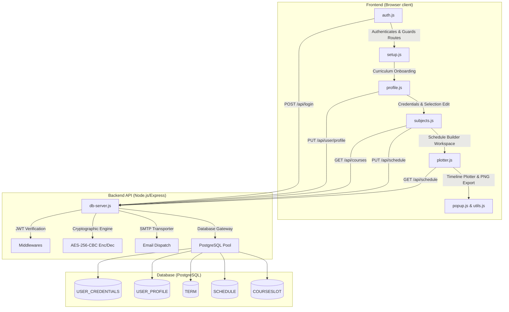

# Academic Schedule Builder - JavaScript Code Reference Guide

This document provides an in-depth analysis of the JavaScript files powering both the backend and frontend of the Academic Schedule Builder application. It highlights key code snippets, details their functions, explains security implementations, and maps out communication protocols.

---

## 🗺️ Architectural Overview

Below is a system interaction diagram illustrating how the frontend scripts communicate with the monolithic backend server and database.



---

## 🖥️ Backend JavaScript Architecture

The backend is built as a monolithic Node.js/Express application interacting with a PostgreSQL database. Security operations (credential encryption and token authorization) are consolidated here.

### 1. Main API Gateway: [db-server.js](file:///c:/Users/theun/Downloads/sched/backend/db-server.js)
The core backend script initializing the Express app, connecting database pools, setting up SMTP, and exposing RESTful endpoints.

#### Key Functions and Code Blocks:

##### A. Cryptographic Engine (`encrypt` & `decrypt`)
The server secures passwords in the database using the `AES-256-CBC` algorithm with a 256-bit hashed key and a randomized Initial Vector (IV).
* **Location:** [db-server.js:L115-154](file:///c:/Users/theun/Downloads/sched/backend/db-server.js#L115-L154)

```javascript
function encrypt(text) {
  try {
    const key = crypto.createHash('sha256').update(String(ENCRYPTION_KEY)).digest();
    const iv = crypto.randomBytes(IV_LENGTH);
    const cipher = crypto.createCipheriv('aes-256-cbc', key, iv);
    let encrypted = cipher.update(text);
    encrypted = Buffer.concat([encrypted, cipher.final()]);
    return iv.toString('hex') + ':' + encrypted.toString('hex');
  } catch (e) {
    console.error('Encryption error:', e);
    return text;
  }
}

function decrypt(text) {
  try {
    if (!text) return '';
    if (!text.includes(':')) return text; // Support legacy cleartext passwords
    const parts = text.split(':');
    const iv = Buffer.from(parts.shift(), 'hex');
    const encryptedText = Buffer.from(parts.join(':'), 'hex');
    const key = crypto.createHash('sha256').update(String(ENCRYPTION_KEY)).digest();
    const decipher = crypto.createDecipheriv('aes-256-cbc', key, iv);
    let decrypted = decipher.update(encryptedText);
    decrypted = Buffer.concat([decrypted, decipher.final()]);
    return decrypted.toString();
  } catch (e) {
    console.error('Decryption error:', e);
    return text;
  }
}
```

##### B. Security Guard Middlewares (`authenticateToken` & `adminOnly`)
Controls API access permissions. `authenticateToken` checks for signed JWT session tokens, and `adminOnly` queries user roles to block non-administrators from dashboard actions.
* **Location:** [db-server.js:L200-209](file:///c:/Users/theun/Downloads/sched/backend/db-server.js#L200-L209) and [db-server.js:L826-840](file:///c:/Users/theun/Downloads/sched/backend/db-server.js#L826-L840)

```javascript
const authenticateToken = (req, res, next) => {
  const token = req.header('Authorization')?.split(' ')[1];
  if (!token) return res.status(401).json({ error: 'Access denied' });

  jwt.verify(token, process.env.JWT_SECRET, (err, user) => {
    if (err) return res.status(403).json({ error: 'Invalid token' });
    req.user = user;
    next();
  });
};

const adminOnly = async (req, res, next) => {
  try {
    const result = await pool.query(
      'SELECT useraccess FROM user_credentials WHERE userid = $1',
      [req.user.user_id]
    );
    if (result.rows.length === 0 || result.rows[0].useraccess !== 'Admin') {
      return res.status(403).json({ error: 'Access denied: Admin role required' });
    }
    next();
  } catch (error) {
    console.error('Admin verification error:', error);
    res.status(500).json({ error: 'Server error' });
  }
};
```

##### C. Nodemailer Password Reset (`sendResetPinEmail`)
Generates secure 6-digit PINs, logs them to `stdout` in development, or dispatches them via SMTP to user accounts.
* **Location:** [db-server.js:L53-107](file:///c:/Users/theun/Downloads/sched/backend/db-server.js#L53-L107)

```javascript
async function sendResetPinEmail(to, pin) {
  const fromEmail = process.env.FROM_EMAIL || 'no-reply@academic-scheduler.com';
  const textContent = `You requested a password reset. PIN: ${pin}`;
  const htmlContent = `...`; // Styled HTML layout containing reset token pin

  if (smtpConfigured && transporter) {
    await transporter.sendMail({
      from: `"Academic Schedule Builder" <${fromEmail}>`,
      to,
      subject: 'Reset your password - Verification PIN',
      text: textContent,
      html: htmlContent
    });
  } else {
    // Development fallback writes mock preview HTML file to log directories
    console.log(`PIN: ${pin}`);
    const logDir = path.join(__dirname, 'logs', 'password-resets');
    ...
    fs.writeFileSync(logFile, ...);
  }
}
```

##### D. Schedule Synchronization (`PUT /api/schedule`)
Allows users to save regular or irregular course layouts. It handles both database course slots and irregular manual schedule entries inside a unified JSON structure (`schedulelist`).
* **Location:** [db-server.js:L507-532](file:///c:/Users/theun/Downloads/sched/backend/db-server.js#L507-L532)

```javascript
app.put('/api/schedule', authenticateToken, async (req, res) => {
  const { schedule_id, schedule_name, total_units, regular, schedule_list } = req.body;
  try {
    let result;
    if (schedule_id) {
      result = await pool.query(
        'UPDATE schedule SET schedulename = $1, totalunits = $2, regular = $3, schedulelist = $4, updatedat = CURRENT_TIMESTAMP WHERE scheduleid = $5 AND userid = $6 RETURNING scheduleid',
        [schedule_name || 'My Schedule', total_units || 0, regular, JSON.stringify(schedule_list), schedule_id, req.user.user_id]
      );
    } else {
      result = await pool.query(
        'INSERT INTO schedule (userid, schedulename, totalunits, regular, schedulelist) VALUES ($1, $2, $3, $4, $5) RETURNING scheduleid',
        [req.user.user_id, schedule_name || 'My Schedule', total_units || 0, regular, JSON.stringify(schedule_list)]
      );
    }
    res.json({ message: 'Schedule saved successfully', schedule_id: result.rows[0].scheduleid });
  } catch (error) {
    res.status(500).json({ error: 'Server error' });
  }
});
```

---

### 2. Password Retrieval Utility: [get_password.js](file:///c:/Users/theun/Downloads/sched/backend/get_password.js)
A secure command-line tool allowing system administrators to locate credentials and decrypt passwords.

* **Location:** [get_password.js](file:///c:/Users/theun/Downloads/sched/backend/get_password.js)
* **Functionality:** Queries the `USER_CREDENTIALS` database by email and decrypts the password using the shared AES-256-CBC utility logic.

```javascript
// Command line execution: node get_password.js user@example.com
const email = process.argv[2];
const result = await pool.query('SELECT UserID, UserEmail, UserPassword, UserAccess FROM USER_CREDENTIALS WHERE LOWER(UserEmail) = LOWER($1)', [email]);
const decryptedPassword = decrypt(result.rows[0].userpassword);
console.log(`Password:  ${decryptedPassword}`);
```

---

## 🎨 Frontend JavaScript Architecture

The frontend consists of modular, single-responsibility scripts that execute within the browser, coordinating layouts, API requests, routing guards, and timetable grid plotting.

### 1. Configuration & Utilities: [utils.js](file:///c:/Users/theun/Downloads/sched/frontend/scripts/utils.js)
Exposes centralized environment settings and security sanitizers.

#### Key Modules:
* **`window.APP_CONFIG`**: Selects the API gateway dynamically (`localhost` vs co-located host or Render/Railway production URLs).
* **`window.APP_UTILS.escapeHtml(str)`**: Protects visual templates against XSS payloads by mapping HTML entities.
* **`window.APP_UTILS.timeStringToMinutes(timeStr)`**: Converts `HH:MM:SS` strings to integer minutes elapsed since midnight.

* **Location:** [utils.js:L31-62](file:///c:/Users/theun/Downloads/sched/frontend/scripts/utils.js#L31-L62)

```javascript
window.APP_UTILS = {
  escapeHtml(str) {
    if (str === null || str === undefined) return '';
    const map = {
      '&': '&amp;', '<': '&lt;', '>': '&gt;', '"': '&quot;', "'": '&#039;', '/': '&#x2F;', '`': '&#x60;', '=': '&#x3D;'
    };
    return String(str).replace(/[&<>"'`=\/]/g, (m) => map[m]);
  },
  timeStringToMinutes(timeStr) {
    if (!timeStr) return null;
    const parts = timeStr.split(':');
    return parseInt(parts[0], 10) * 60 + parseInt(parts[1], 10);
  }
};
```

---

### 2. OOP Classes: [classes.js](file:///c:/Users/theun/Downloads/sched/frontend/scripts/classes.js)
Defines basic data structures representing physical entities.

* **Location:** [classes.js](file:///c:/Users/theun/Downloads/sched/frontend/scripts/classes.js)
* **Classes:**
  - `Professor(profId, name, department)`: Stores metadata for academic faculty.
  - `CourseSlot(courseSlotId, courseCode, profId, startTime, endTime, day, room)`: Stores schedule slots.
  - `Course(courseCode, termId, name, units, slots)`: Collects course information and associated slots.

---

### 3. Modal UI Builder: [popup.js](file:///c:/Users/theun/Downloads/sched/frontend/scripts/popup.js)
Overrides default browser dialog windows (`alert` and `confirm`) with custom, animated UI elements.

#### Key Functions:
* **`window.alert(message, title)`**: Injects a custom modal. It automatically parses text messages to apply appropriate icons (🔔 Notice, ⚠️ Warning, ❌ Error, ✅ Success) and CSS classes.
* **`window.confirmPopup(message, onConfirm, onCancel, title)`**: Renders a confirmation overlay, executing callbacks asynchronously.
* **`window.handleLogout(redirectPath)`**: Confirms logout, clears session storage keys, and redirects the user.

* **Location:** [popup.js:L23-41](file:///c:/Users/theun/Downloads/sched/frontend/scripts/popup.js#L23-L41)

```javascript
// Example message-based auto-styling
if (msgLower.includes('conflict') || msgLower.includes('⚠️')) {
  icon = '⚠️';
  typeClass = 'warning';
} else if (msgLower.includes('error') || msgLower.includes('failed')) {
  icon = '❌';
  typeClass = 'error';
}
```

---

### 4. Curriculum Selector: [setup.js](file:///c:/Users/theun/Downloads/sched/frontend/scripts/setup.js)
Coordinates onboarding pages where users choose their academic departments, year levels, and semesters.

#### Key Operations:
* **Onboarding Guard**: Checks if security credentials are saved locally; otherwise, redirects to `login.html`.
* **Dependent Dropdowns**: Listens to changes in the program selector and rebuilds year levels (up to `totalyears`) and semesters (up to `semestertype`) dynamically.
* **Selection Submission**: Sends payload inputs to `/term` routes, stores the returned `termId` in local storage, and loads the main panel application pages.

---

### 5. Authentication & Access Guard: [auth.js](file:///c:/Users/theun/Downloads/sched/frontend/scripts/auth.js)
Controls route access, session verification, and token propagation.

#### Key Functions and Logic:

##### A. Sandboxed Token Propagation (`getToken` & `redirectWithToken`)
When operating under the `file://` protocol, browser instances restrict cross-directory storage access. These functions preserve security tokens by propagating credentials in the URL query string.
* **Location:** [auth.js:L14-46](file:///c:/Users/theun/Downloads/sched/frontend/scripts/auth.js#L14-L46)

```javascript
function getToken() {
  const urlParams = new URLSearchParams(window.location.search);
  const urlToken = urlParams.get('token');
  if (urlToken) {
    localStorage.setItem('token', urlToken);
    const urlUser = urlParams.get('user');
    if (urlUser) localStorage.setItem('user', decodeURIComponent(urlUser));
    return urlToken;
  }
  return localStorage.getItem('token');
}

function redirectWithToken(targetUrl) {
  const token = localStorage.getItem('token');
  const user = localStorage.getItem('user');
  if (window.location.protocol === 'file:' && token) {
    const separator = targetUrl.includes('?') ? '&' : '?';
    const params = `token=${encodeURIComponent(token)}` + (user ? `&user=${encodeURIComponent(user)}` : '');
    window.location.href = targetUrl + separator + params;
  } else {
    window.location.href = targetUrl;
  }
}
```

##### B. Authentication Guard & Admin UI Modifier (`initAuth`)
Queries user data from the server to synchronize current roles. If the user has `Admin` access, it injects the admin panel navigation button.
* **Location:** [auth.js:L105-143](file:///c:/Users/theun/Downloads/sched/frontend/scripts/auth.js#L105-L143)

```javascript
async function initAuth() {
  const token = getToken();
  if (token) {
    try {
      const response = await fetch(`${API_BASE}/user-session`, {
        headers: { 'Authorization': `Bearer ${token}` }
      });
      if (response.ok) {
        const freshUser = await response.json();
        localStorage.setItem('user', JSON.stringify(freshUser));
        ... // Renders navigation paths and injects Admin panels
      } else if (response.status === 401 || response.status === 403) {
        localStorage.removeItem('token');
        localStorage.removeItem('user');
      }
    } catch (e) {
      fallbackAutologinRedirect(); // Restores cached sessions if API is offline
    }
  }
}
```

---

### 6. Profile Manager: [profile.js](file:///c:/Users/theun/Downloads/sched/frontend/scripts/profile.js)
Coordinates updating personal details and curriculum options inside user profile screens.

#### Key Functions:
* **`handleFieldToggle`**: Toggles inputs (username, email, password) between read-only and edit modes. It issues REST PUT requests to `/user/profile` and refreshes username displays across header panels.
* **`saveToServer` & `loadFromServer`**: Saves current program selection details to backend systems. It falls back to local storage caches if the API goes offline.
* **Password Visibility**: Toggles password visibility by modifying the input's `type` attribute (`password` vs `text`) and updating the visual inline SVG eye icon.

---

### 7. Interactive Workspace Builder: [subjects.js](file:///c:/Users/theun/Downloads/sched/frontend/scripts/subjects.js)
The core of the scheduler workspace. It manages course selection, audits time conflicts, and synchronizes saved configurations.

#### Key Functions and Audit Logic:

##### A. Overlap Audit Logic (`doTimesOverlap`)
Determines if two daily courses conflict by comparing their start and end times in absolute minutes.
* **Location:** [subjects.js:L99-107](file:///c:/Users/theun/Downloads/sched/frontend/scripts/subjects.js#L99-L107)

```javascript
function doTimesOverlap(start1, end1, start2, end2) {
  const start1Min = timeStringToMinutes(start1);
  const end1Min = timeStringToMinutes(end1);
  const start2Min = timeStringToMinutes(start2);
  const end2Min = timeStringToMinutes(end2);

  if (!start1Min || !end1Min || !start2Min || !end2Min) return false;
  return start1Min < end2Min && start2Min < end1Min;
}
```

##### B. Dynamic Workspace Conflict Inspector (`checkScheduleConflict`)
Audits both formal database schedules and manual irregular entries to ensure a new class block does not overlap with existing selections.
* **Location:** [subjects.js:L117-148](file:///c:/Users/theun/Downloads/sched/frontend/scripts/subjects.js#L117-L148)

```javascript
function checkScheduleConflict(newDay, newStartTime, newEndTime) {
  for (let course of courses) {
    let courseDay, courseStartTime, courseEndTime;
    if (course.schedule) {
      courseDay = course.schedule.day;
      courseStartTime = course.schedule.startTime;
      courseEndTime = course.schedule.endTime;
    } else if (course.slots && course.slots.length > 0) {
      courseDay = course.slots[0].day;
      courseStartTime = course.slots[0].startTime;
      courseEndTime = course.slots[0].endTime;
    } else {
      continue;
    }

    if (courseDay && courseDay.toLowerCase() === newDay.toLowerCase()) {
      if (doTimesOverlap(courseStartTime, courseEndTime, newStartTime, newEndTime)) {
        return {
          conflict: true,
          conflictingCourse: course.code || course.courseCode,
          conflictingDay: courseDay,
          conflictingTime: `${courseStartTime} - ${courseEndTime}`
        };
      }
    }
  }
  return { conflict: false };
}
```

##### C. Status Validation & Unit Tallying (`displayCourses`)
Renders the scheduled courses list. It tallies cumulative units and validates whether the schedule is **REGULAR** (total units match requirements and there are no manual entries) or **IRREGULAR** (contains manually added courses or has a unit mismatch).
* **Location:** [subjects.js:L394-505](file:///c:/Users/theun/Downloads/sched/frontend/scripts/subjects.js#L394-L505)

```javascript
function displayCourses() {
  ...
  let totalUnits = 0;
  let hasIrregular = false;
  
  courses.forEach((course) => {
    if (!course.courseslot_id) {
      totalUnits += parseInt(course.units || 0, 10);
      hasIrregular = true; // Mark as irregular due to manual entry
      ... // Render manual course card
    } else {
      totalUnits += parseInt(course.units || 0, 10);
      ... // Render database course card
    }
  });

  const reqUnits = parseInt(localStorage.getItem('reqUnits')) || 0;
  const isRegular = (totalUnits === reqUnits) && !hasIrregular;
  
  // Render badge details dynamically
  statusBadge.textContent = isRegular ? 'REGULAR' : 'IRREGULAR';
  ...
}
```

---

### 8. Timetable Visualizer: [plotter.js](file:///c:/Users/theun/Downloads/sched/frontend/scripts/plotter.js)
Generates absolute-positioned schedule previews on a grid and handles image export.

#### Key Functions and Plotting Coordinates:

##### A. Mathematical Coordinate Grid Plotting (`plotBlock`)
Converts time strings into absolute coordinates on the grid using a `1 minute = 1 pixel` vertical scale. Horizontal offsets are calculated across a 6-day column system (Monday to Saturday, each spanning `100/6`% width).
* **Location:** [plotter.js:L189-273](file:///c:/Users/theun/Downloads/sched/frontend/scripts/plotter.js#L189-L273)

```javascript
function plotBlock(course, day, startTime, endTime, room, bgColor, fontColor, isIrregular = false) {
    const startMins = parseTime(startTime);
    const endMins = parseTime(endTime);
    const dayStartMins = 7 * 60; // Grid starts at 7:00 AM

    if (startMins < dayStartMins) return;

    // Y coordinate: minutes offset since grid start
    const topPx = startMins - dayStartMins;
    const heightPx = endMins - startMins;

    // X coordinate: column index mapping
    const dayIndex = getDayIndex(day);
    const leftPercent = dayIndex * (100 / 6);
    const widthPercent = 100 / 6;

    const block = document.createElement('div');
    block.className = 'course-block';
    if (isIrregular) block.className += ' irregular-block';
    
    block.style.top = `${topPx}px`;
    block.style.height = `${heightPx}px`;
    block.style.left = `${leftPercent}%`;
    block.style.width = `${widthPercent}%`;
    block.style.backgroundColor = bgColor;
    block.style.color = fontColor;
    
    // Safety: properties rendered via .textContent to prevent HTML/XSS injection
    const codeEl = document.createElement('div');
    codeEl.textContent = course.code;
    block.appendChild(codeEl);
    ...
    blocksContainer.appendChild(block);
}
```

##### B. Canvas Image Exporter (`html2canvas`)
Uses the `html2canvas` library to capture the container element and export the grid as a high-resolution PNG file.
* **Location:** [plotter.js:L276-300](file:///c:/Users/theun/Downloads/sched/frontend/scripts/plotter.js#L276-L300)

```javascript
btnSavePng.addEventListener('click', async () => {
    const captureArea = document.getElementById('capture-area');
    try {
        const canvas = await html2canvas(captureArea, {
            backgroundColor: null,
            scale: 2 // Boost scale to export high-DPI imagery
        });
        const image = canvas.toDataURL("image/png");
        const link = document.createElement('a');
        link.href = image;
        link.download = 'My_Schedule.png';
        link.click();
    } catch (err) {
        console.error('Failed to capture PNG:', err);
    }
});
```

---

## 🔒 Security Practices Highlight
* **XSS Sanitization:** The frontend sanitizes all dynamically rendered data using the standard [escapeHtml](file:///c:/Users/theun/Downloads/sched/frontend/scripts/utils.js#L35-L48) utility. In [plotter.js](file:///c:/Users/theun/Downloads/sched/frontend/scripts/plotter.js#L221-L270), absolute grid block texts are rendered via `.textContent` assignments rather than `.innerHTML` insertions to prevent scripts from executing.
* **Credential Protection:** Users' passwords are encrypted in transit and stored as AES-256-CBC cipher blocks.
* **SQL Injection Mitigation:** Backend queries in [db-server.js](file:///c:/Users/theun/Downloads/sched/backend/db-server.js) use parameterized SQL statements (e.g., `LOWER($1)`) via the PostgreSQL driver (`pg`).
* **Route Protection:** Access to dashboards and data sync options is guarded by verified JWT bearer tokens via the `authenticateToken` and `adminOnly` Express middleware layers.
